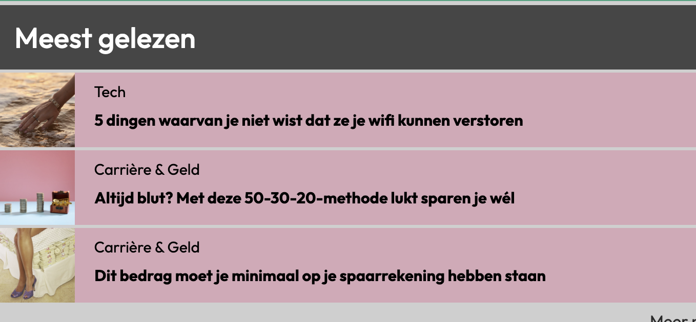
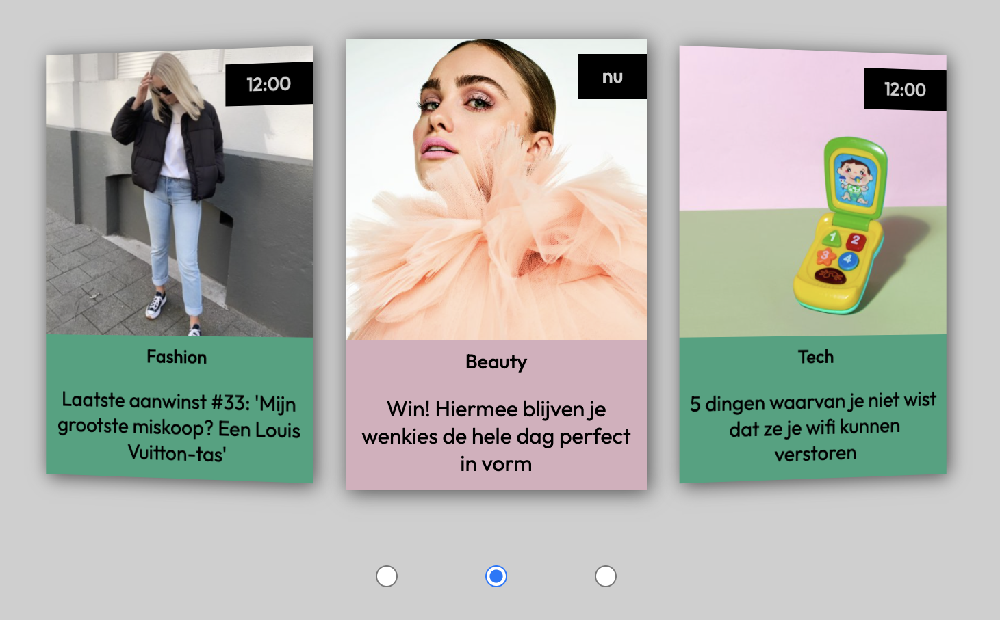

# Procesverslag
Markdown is een simpele manier om HTML te schrijven.  
Markdown cheat cheet: [Hulp bij het schrijven van Markdown](https://github.com/adam-p/markdown-here/wiki/Markdown-Cheatsheet).

Nb. De standaardstructuur en de spartaanse opmaak van de README.md zijn helemaal prima. Het gaat om de inhoud van je procesverslag. Besteedt de tijd voor pracht en praal aan je website.

Nb. Door *open* toe te voegen aan een *details* element kun je deze standaard open zetten. Fijn om dat steeds voor de relevante stuk(ken) te doen.

## Jij

uitwerken voor kick-off werkgroep

### Auteur:
Noor Meijns

#### Je startniveau:
Blauw

#### Je focus:
Surface
 

## Je website

uitwerken voor kick-off werkgroep

### Je opdracht:
https://www.andc.tv 

#### Screenshot(s) van de eerste pagina (small screen): 
Homepagina van &C  

#### Screenshot(s) van de tweede pagina (small screen):
Artikel van &C  

 

## Breakdownschets (week 1)

uitwerken na afloop 2e werkgroep

### de hele pagina: 

### dynamisch deel navigatie: 

## Voortgang 1 (week 2)

uitwerken voor 1e voortgang

### Stand van zaken
hier dit ging goed & dit was lastig (neem ook screenshots op van delen van je website en code)

### Agenda voor meeting
samen met je groepje opstellen

| Cera                          | Edward             | Noor         | Xavier           |
| ---                           | ---                | ---          | ---              |
| Hoe je een hamburgermenu maakt  | Wilt weten hoe je een carrousel moet maken            | Hoe je een foto carrousel maakt    | Hoe je iconen moet toevoegen    |
| Hoe iconen toevoegen              |  |  | Wilt ook weten hoe je een hamburger menu maakt |

### Verslag van meeting
hier na afloop snel de uitkomsten van de meeting vastleggen

- We hebben het gehad over hoe je een hamburgermenu kan maken
- Ik heb als tip gekregen om eerst ervoor te zorgen dat mijn webpagina het doet en om daarna pas te gaan kijken hoe je de carroussel maakt.
- In mijn html moest ik alleen nog één aanpassing maken. Ik heb mijn h2'tjes en h3'tjes in de section gezet. 

## Voortgang 2 (week 3)

uitwerken voor 2e voortgang

### Stand van zaken
hier dit ging goed & dit was lastig

 Tijdens het maken van de website ging het navigatie menu erg goed en de plaatsing van de foto's in de carrousel. Ik ben nu nog bezig met het gedeelte "Abonnee worden?" en ik moet de link nog vormgeven met CSS. Die zien er namelijk anders uit op de website van &C. 
 
 

 
 Wat ik lastiger vind is hoe ik de carrousel moet maken, maar ik ben nu bezig om eerst de hele webpagina neer te zetten. Dan kan ik later kijken naar de carrousel. 
 Voor de rest ging alles goed. De homepagina is al bijna klaar. Ik moet alleen nog wat artikelen toevoegen de abonnee worden section vormgeven, daarna wil ik de carrousel werkend maken.

### Agenda voor meeting
samen met je groepje opstellen

| Noor     | Cera         | Edward    | Xavier       |
| ---            | ---                | ---          | ---              |
| Vragen of h1 onzichtbaar maken goed is  | Hoe maak je een scrollbar om tussen foto's te scrollen. | Hoe maak je een darkmode toglle?  | Hoe kan ik in mijn footer 2 kleuren toevoegen?   |
| Mag je alt gebruiken in <a>?  | Vraag over een plaatje in haar website | | |

### Verslag van meeting
hier na afloop snel de uitkomsten van de meeting vastleggen

- We hebben het gehad over hoe je darkmode moet toevoegen.
- Daarnaast heb ik mijn vragen kunnen stellen. Ik heb daarom de alts in alle <a> weggehaald.
- Ook heb ik mijn h1 verandert. Ik heb daar nu mijn logo in staan i.p.v. de h1 verborgen te maken met CSS.
- Ik moet nu alleen het logo in een <a> zetten op een detailpagina. Dan kan je terug naar de homepagina als je erop klikt.

## Toegankelijkheidstest (week 4)

uitwerken na test in 8e voortgang

### Bevindingen
Lijst met je bevindingen die in de test naar voren kwamen:

#### Tekstgrootte
Uit de test kwam dat mijn tekst op de artikelpagina niet groot genoeg is. Als je slechter zicht hebt is het heel klein.
Daarom heb ik de font-size aangepast naar 1.2em.
 

#### Nav grootte
Uit de test bleek ook dat mijn navigatie balk klein was. De ruimte om te klikken is kleiner waardoor het lastiger wordt als je handicap hebt. 
 

Ik heb in mijn code de hoogte van de a's met padding groter gemaakt waardoor de je nu meer klikbare ruimte boven en onder de tekst hebt.
 

#### Te dikgedrukt 
Uit de test bleek ook dat als je bijvoorbeeld ADHD hebt dat de dikgedrukte titels in de caroussel lastiger te lezen zijn. Ze worden dan gezien als een zwart blok.
 

Ik heb daarom de font-weight aangepast, zodat ze minder dik zijn.
 

## Voortgang 3 (week 4)

uitwerken voor 3e voortgang

### Stand van zaken
hier dit ging goed & dit was lastig (neem ook screenshots op van delen van je website en code)

### Agenda voor meeting
samen met je groepje opstellen

| Noor      | Cera          | Edward    | Xavier       |
| ---            | ---                | ---          | ---              |
| Bij de nieuwsbrief section krijg ik paar elementen niet onderelkaar   | Bepaalde linkjes staan niet goed            | -    | Wilde kijken hoe hij zijn html kan verbeteren |
| Kijken of mijn html wel klopt  | Ook graag checken of html klopt | nog een punt | dit wil ik zeker |
|            | ...                | ...          | ...              |

### Verslag van meeting
hier na afloop snel de uitkomsten van de meeting vastleggen

- Uit de meeting kregen we goede tips over onze html en dat we het kunnen checken met de validator
- Ik heb mijn nieuwsbrief section aan kunnen passen zodat het nu wel werkt.
- nog een punt

## Eindgesprek (week 5)

uitwerken voor eindgesprek

### Stand van zaken
De navigatie en de lijsten gingen goed, maar de caroussel was wel echt lastig. Ook wist ik niet zo goed hoe ik de plaatjes, titels in de lijsten goed kon plaatsen.
Maar nadat ik werd geholpen daarmee snapte ik het. Ik heb dat uiteindelijk met display:grid; gedaan. 

Voor de caroussel heb ik op internet gezocht naar goede bronnen over hoe je dat kon doen. Uiteindelijk heb ik er een gevonden die goed was en die ik een beetje snapte. 

### Screenshot(s)

hier screenshot(s) van je eindresultaat

## Bronnenlijst

continu bijhouden terwijl je werkt

Nb. Wees specifiek ('css-tricks' als bron is bijv. niet specifiek genoeg).

1. Bron carrousel: https://codepen.io/onion2k/pen/xxZYBVj
2. Bron voor flexbox: https://css-tricks.com/snippets/css/a-guide-to-flexbox/
3. Bron voor display: grid: https://css-tricks.com/snippets/css/complete-guide-grid/
4. Bron navigatie: eigen werk opdracht van internetstandaarden

